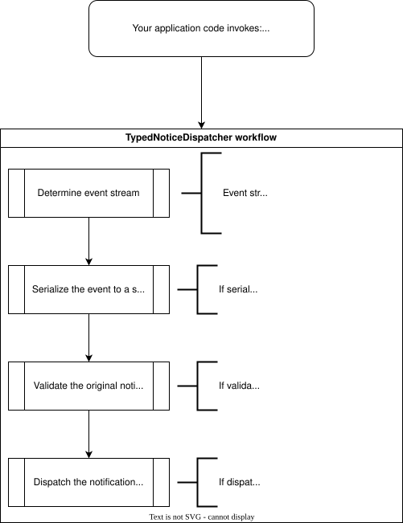

# How does `ITypedNoticeDispatcher<TEnterpriseEventBaseType>` dispatch "typed notices" (e.g., an `EnterpriseEvent`)?

The central service dependency from NiceNotice which applications depend upon is `ITypedNoticeDispatcher<TEnterpriseEventBaseType>` (where `TEnterpriseEventBaseType` is `EnterpriseEvent` or a custom type you've created). Below you'll find the logical work performed by the default implementation.

The implementations of the logical steps of routing, serializing, validating, and dispatching are all configured at the application service configuration root (e.g., in `Program.cs` or `Startup.cs`) when you invoke `services.AddNiceNotice()`.

By default:

* Notices are routed to logical streams (`EventStreamId`) based on their type name. (E.g., `record UserLoggedIn {}` would be `UserLoggedIn`).
* Notices are serialized to JSON.
* Notices are validated based upon their data attributes (if used).
* Notices are dispatched to the registered `INoticeIo`.

## Single Notice

## Batch of Notices

